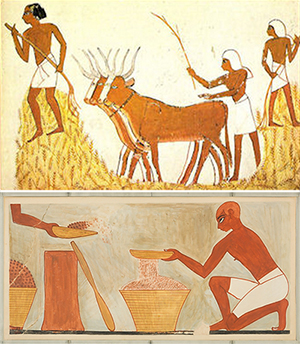

Our introduction of prime numbers leads to a great many questions:
* What are the prime numbers?
* How many prime numbers are there?
* Given an integer, how can we tell whether that integer is prime?

## A formula for primes?

One of the simplest questions one could start by asking is whether there is a nice way to build prime numbers.
For example, one could as for some kind of equation where you put in an integer $$x$$, and out pops a prime number.

**Example:** Consider the polynomial $$f(x) = x^2 + x + 41$$.  It takes values

|$$x$$|$$f(x)$$|
|-----|--------|
|  0  |   41   |
|  1  |   43   |
|  2  |   47   |
|  3  |   53   |
|  4  |   61   |
|  5  |   71   |
|  6  |   83   |

Each of the terms on the right hand side is prime!  Maybe it's true that for every positive integer we put in, the output will be prime?
This was proven to be **false** by Euler.  In fact, $$f(40) = 41^2$$.

In fact, one can prove that it is impossible to find a *polynomial* formula which always returns prime values.

**Theorem:**  Let $$f(x)$$ be a polynomial with integer coefficients.  Then there exist infinitely many integers $$n>0$$ with $$f(n)$$ not prime.

**Proof:**  Suppose that $$f(x) = \sum_{k=0}^na_kx^k$$ and $$p=f(x_0)$$ is prime.  Then by the Binomial Theorem, for every $$r>0$$

$$f(rp+x_0) = \sum_{k=0}^n a_k(rp+x_0)^k = p + \sum_{k=0}^n\sum_{j=1}^k\binom{k}{j}a_kr^jp^jx_0^{k-j}$$

is divisible by $$p$$.
The statement follows immediately.
:black_square_button:

At this point, one might begin to wonder how many primes there are.
There are a great many ways to try to answer this question, but Euler gives us a particularly simple one.

**Theorem (Euler):** There are infinitely many primes.

**Proof:** Suppose that there are only finitely many primes $$p_1,\dots, p_n$$.  Then the number $$p_1p_2\dots p_n+1$$ should have a prime factorization, however, it is not divisible by any of the primes!
:black_square_button:

As a refinement of this result, maybe we could ask for a given integer $$n$$ how many primes there are less than $$n$$.
This gives rise to th **prime counting function**.

**Definition:** The **prime counting function** $$\pi(n)$$ is the number of primes less than $$n$$.

To get a classical sort of estimate for the prime counting function, we can use an argument attributed to Chebyshev, based on the prime factorization of the binomial coefficient $$\binom{2n}{n}$$.  Intuitively, this is a number which involves the product of many small primes (due to the factorial).

Start by considering $$m>1$$.  How many times does a prime $$p$$ occur as a factor in $$m!$$ ?
The answer is to choose $$k_p\geq 0$$ such that $$p^{k_p}\leq m < p^{k_p+1}.$$
Then the number of factors of $$p$$ in $$m!$$ is

$$\sum_{j=1}^{k_p} \lfloor m/p^j\rfloor.$$

Threfore (taking $$m=2n$$) the number of times $$p$$ occurs as a factor in $$\binom{2n}{n}$$ is

$$\sum_{j=1}^{k_p}\lfloor 2n/p^j\rfloor - 2\lfloor n/p^j\rfloor.$$

Each of the terms in the summand is no larger than $$1$$, so the number of times $$p$$ occurs in the factorization of $$\binom{2n}{n}$$ is no more than $$k_p$$.
Hence

$$\binom{2n}{n}\leq \prod_{p\leq 2n\ \text{prime}} p^{k_p} \leq (2n)^{\pi(2n)}.$$

Using this inequality, we obtain a lower bound for $$\pi(n)$$.

**Theorem (Chebyshev):**  $$\pi(2n)\geq \frac{1}{\log(2n)}\log\binom{2n}{n}.$$

For example, this estimate says that there are at least $$14$$ double-digit prime numbers.  (Actually there are $$25$$).  

## Sieve of Eratosthenes

As a futhr refinement of the questions explored above, one could try to answer the question of what the prime numbers between $$2$$ and $$n$$ are, for a given integer $$n$$.

The ancient Greeks had a simple, iterative algorithm for finding the prime numbers up to a given order.
1. Create a list of all numbers between $$2$$ and a fixed integer $$n$$.
2. Starting with $$p=2$$, cross off all composite multiples of $$p$$.
3. Next find the smallest number greater than $$p$$ not crossed out.  This new number is necessarily prime.
4. Repeat starting from Step 2 with $$p$$ equal to the new found prime.
5. When this process terminates, any remaining numbers must be prime.

**Check:** Try using the sieve of Erastothenes to find all the two-digit primes.

